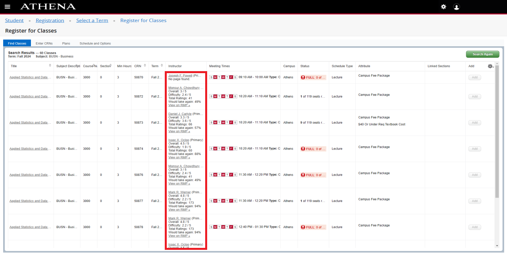
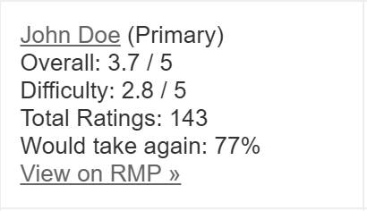

# uga-rmp-extension
**Description:** This Chrome extension seamlessly integrates Rate My Professors (RMP) data directly into the University of Georgia's Athena course registration page, providing you with valuable professor insights and metrics right where you need them. 

## Preview
 
*Red outline indicates where Rate My Professors metrics are automatically inserted*

 
*Detailed view of Rate My Professors metrics added to each professor's cell*

## Features
* Automatic professor detection and metric integration
* Real-time data fetching from Rate My Professors via the Rate My Professors GraphQL API
* Direct display of comprehensive metrics including:
    * Overall Rating (out of 5)
    * Difficulty Score (out of 5)
    * Total Number of Ratings
    * Would Take Again Percentage
* Clickable links to full Rate My Professors profiles
* Fallback handling for professors without Rate My Professors pages

## Installation
### Chrome Web Store (Coming Soon)
1. Visit the Chrome Web Store page (link coming soon)
2. Click "Add to Chrome"
3. Follow the prompts to complete installation

### Manual Installation (For Development)
1. Clone this repository: `git clone https://github.com/[your-username]/uga-rmp-extension.git`
2. Open Chrome and navigate to chrome://extensions/
3. Enable "Developer mode" using the toggle in the top-right corner
4. Click "Load unpacked"
5. Select the directory containing the extension files

## Usage
1. Navigate to the Athena registration page and make a search within the **Register for Classes** or **Browse Classes** sections.
2. The extension automatically detects professor names found in the search results
3. Within a few seconds, metrics will appear in each professor's table cell in the following format:
    * Overall Rating (out of 5)
    * Difficulty Score (out of 5)
    * Total Number of Ratings
    * Would Take Again Percentage
    * View on RMP »
4. Click "View on RMP »" to visit the professor's full Rate My Professors profile based on their most relevant department
5. For professors without a Rate My Professors, "No page found." will be displayed

## Configuration
This extension currently operates without requiring any configuration. It automatically:
* Detects professor names in schedule tables
* Fetches and displays relevant metrics
* Updates information when the page changes

## Browser Support
* Chrome/Chromium-based browsers
* Other browsers not currently supported

## Limitations
* **UGA Athena Only:** This extension is specifically designed for the University of Georgia's Athena course registration system. It will not work or function properly on other university websites or course registration platforms.

* **Performance:** Retrieving Rate My Professors data for a large number of search results (e.g., more than 10 courses) can sometimes take a few seconds. If you experience slowdowns, try refining your search to reduce the number of displayed courses.

* **Rate My Professors Data Dependence:** The accuracy and availability of professor ratings depend entirely on Rate My Professors data. Some professors may not have RMP profiles, and existing ratings may not always be representative of all student experiences.

* **Professor Department Matching:** The displayed department for a professor is based on their most-reviewed department on Rate My Professors. This may not always match the department of the course they are currently teaching, especially if the professor teaches in multiple departments.

## License
This project is licensed under the MIT License. This extension was developed independently as a personal project to enhance the course registration experience at the University of Georgia. It leverages the publicly available Rate My Professors API to provide students with valuable professor insights.

Due to the nature of the Rate My Professors API and the limited ways to access its data, the technical implementation of certain functionalities, such as querying the API using GraphQL, might share similarities with other projects that also utilize this API. However, the core logic of this extension, including:
- DOM manipulation
- User interface elements
- Error handling
- Specific integration with the UGA Athena registration system
- Overall code structure and architecture

are the result of my own independent development efforts.

See the [LICENSE](LICENSE) file for details.
